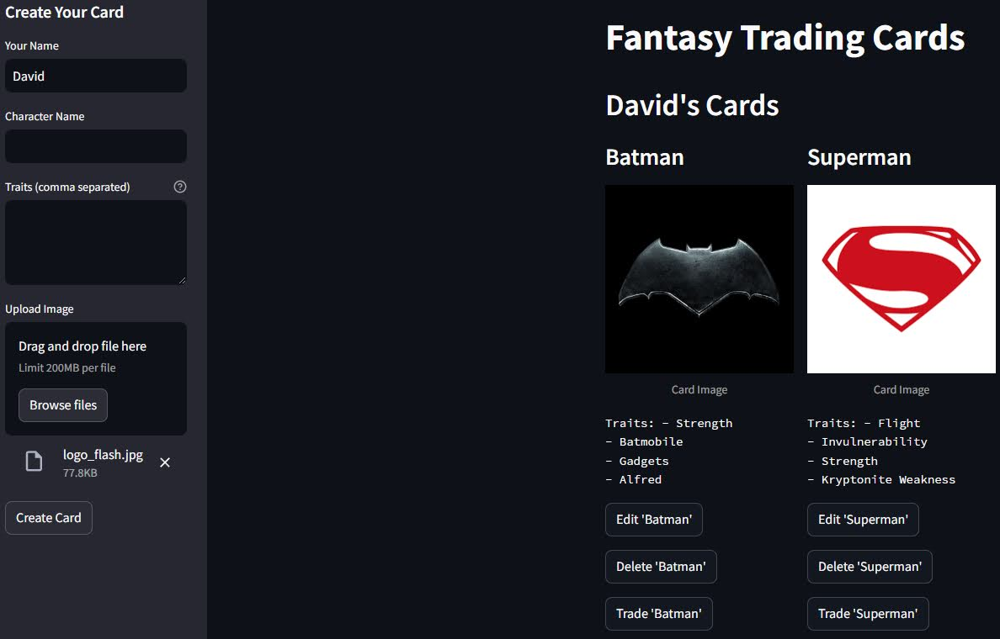
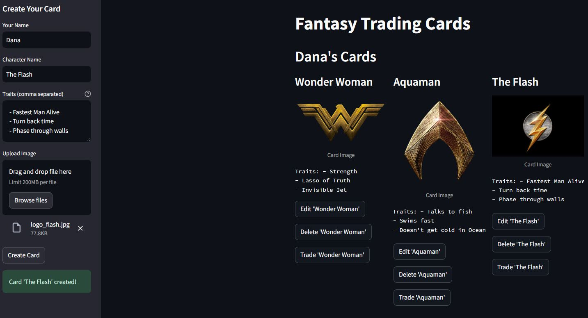

# [Fantasy Trading Card Web App](https://harhar2000-trading-card-web-app-trading-game-yruq1c.streamlit.app/)

☝️ Click the title to see in action!☝️

This project is a **Fantasy Trading Cards** app built using [Streamlit](https://streamlit.io/). Users can create, edit, trade, and delete fantasy character cards with unique images and traits. 

## Features
- Create cards with a player name, character name, traits and an image.
- Edit the character name, traits or image of existing cards.
- Trade cards between players.
- Delete unwanted cards.

## How to Use

### Create a Card:
1. Go to the sidebar and enter your **name**, **character name**, and **traits** (comma-separated).
2. Upload an image or use the randomly generated card image.
3. Click **Create Card** to generate a new card.

### Edit a Card:
1. Under each card, click the **Edit** button to modify the character name, traits, or image.
2. Make your changes and click **Save Changes** to apply the updates.

### Delete a Card:
- Click the **Delete** button under a card to remove it permanently.

### Trade a Card:
1. Click the **Trade** button to initiate a trade.
2. Select the player you want to trade with, choose one of their cards, and confirm the trade.


## Player Views

<p align="center">
  
</p>

<p align="center">
  
</p>

## Trading Cards

<p align="center">
  
</p>


## Known Issue
- Some buttons like **Trade**, **Delete**, and **Save Changes** need to be clicked twice to take effect.

## Installation

1. Clone the repository:
   ```bash
   git clone https://github.com/your-username/fantasy-trading-cards.git
   cd fantasy-trading-cards
   ```

2. Install Dependencies
    ```bash
    pip install -r requirements.txt
    ```

3. Run the Streamlit app
    ```bash
    streamlit run trading_game.py
    ```

## Dependencies
- **Streamlit** - Web application framework
- **Pillow** - Image manipulation library
- **uuid** - Generate unique identifiers for cards
- **random** - Generate random values for card images

To install dependencies:
    ```bash
    pip install streamlit pillow
    ```